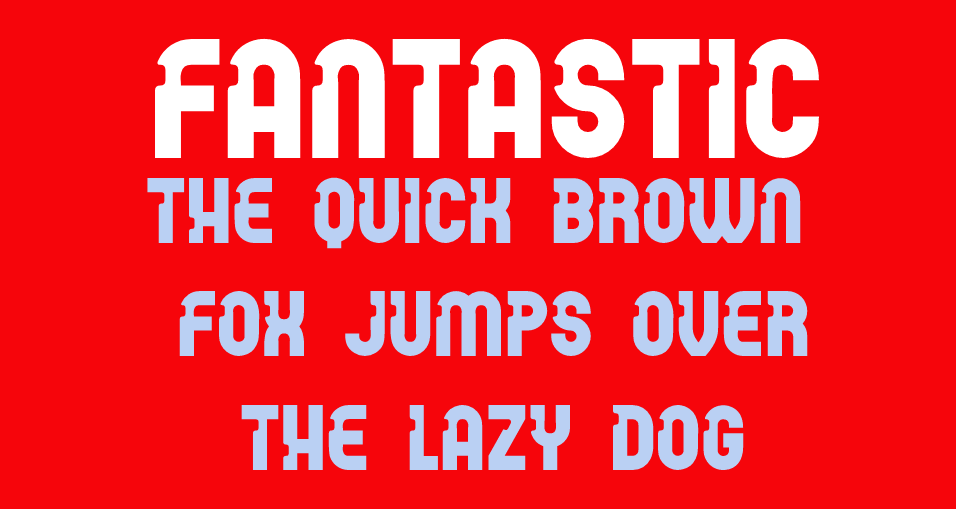

# Fantastic

Borrowed from Middle French fantastique, borrowed from Late Latin phantasticus, borrowed from Ancient Greek φᾰντᾰστῐκός (phăntăstĭkós, “imaginary, fantastic; fictional”), ultimately from Proto-Indo-European *bʰeh₂- (“to shine”). Equivalent to fantasy +‎ -tic. Doublet of fantastique..

## Variable Font Axe

Axis | Tag | Default | Static Instances
--- | --- | --- | ---
Weight | wght | 400 | Regular

## License

This Font Software is licensed under the SIL Open Font License, Version 1.1.
This license is available with a FAQ at [https://openfontlicense.org](https://openfontlicense.org)

